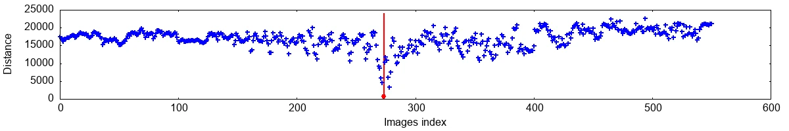

# Picor - a tool to find the nearest picture in a collection

This tool is an experiment to compare picture retrieving methods.
It is suitable to find out the best nearest picture in a collection where there
are a lot of similar pictures.

For example, given an image extracted from a video, we can find this exact
image in the same video but using different encoding and quality (resolution,
colorimetry, codec, framerate...).

## Result example

This is an example of output when using `picor-basic-pic-retriever-stats`.
It has been run 551 images on an Intel(R) Core(TM) i7-7500U CPU @ 2.70GHz 2017
laptop.


Below, images transformation time is not taken inout account.

### Average hash

Hashes computation took 0.001447s, hashes comparison 0.000042s.




### Cross-correlation

Cross-correlation took 0.001465s.


## Installation

First install the dependencies:

- ImageMagick
- gnuplot

Then, install in `/usr/local`:

```
mkdir build
cd build
autoreconf -fi ..
../configure
make
sudo make install
```

If you want to install in `/usr` instead, call `configure` like this:

```
../configure --prefix=/usr
```

If you installed in `/usr/local`, add this line at the end of your `~/.bashrc`
or `~/.zshrc`:

```
export PKG_CONFIG_PATH=/usr/local/lib/pkgconfig:$PKG_CONFIG_PATH
```

## Usage

### Index and retrieve

This tool can use cross correlation or average hash to index and retrieve
pictures.

```
picor-basic-pic-retriever method collection_folder picture_file
```

where method can be `xcorr` or `avghash`, `collection_folder` and
`picture_file` have to be absolute paths.

For each file in collection folder, you will see:

```
file_index file_name distance
```

where distance is the distance with the picture file you are looking for in the
collection.
The distance tends towards 1 for cross correlation better match, and towards 0
for average hash better match.

#### Generate report

To help compare methods accuracy you may want to generate reports.
Run the dedicated tool:

```
picor-basic-pic-retriever-stats method collection_folder picture_file
```

You will get as output a `stats_results` folder, you can open the `view.html`
file inside to see the results.

### Index and retrieve later

This tool is using average hash to index and retrieve pictures.

First of all, index a folder containing collection of pictures:

```
picor-index-folder collection_folder
```

`collection_folder` have to be absolute path.

This step can take a while, then in the local folder, a `db.idx` file has been
created, indexing your collection folder pictures.

Retrieve in the collection a similar picture:

```
picor-retrieve-pic picture_file
```

this step is fast.

### Working with videos

The goal here is to identify an exact same frame between two same videos, but
using different encoding and quality.

Picor is working on pictures. So, you have to extract movie frames:

```
ffmpeg -i my_movie_file output_dir/img_%06d.jpg
```

For example:
```
ffmpeg -i elephants_dream_360p.avi frames_360p/img_%06d.jpg
ffmpeg -i elephants_dream_1080p.mp4 frames_1080p/img_%06d.jpg
```

Then, you can use tools presented above to work on this data.

